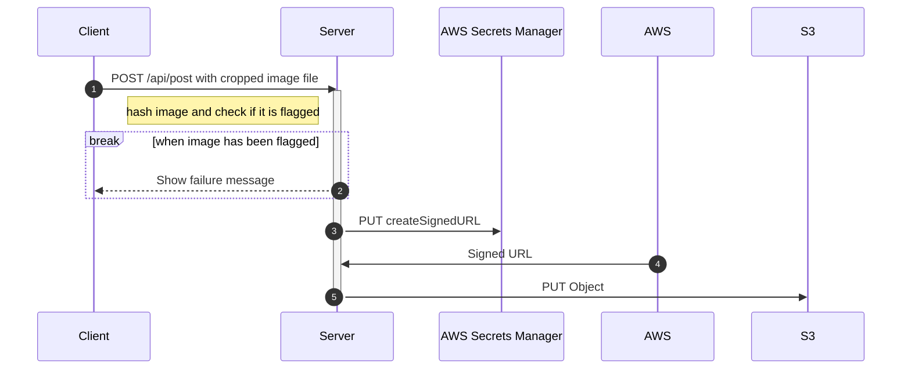

```mermaid
sequenceDiagram
  autonumber
  Client->>Server: POST /api/post with cropped image file
    activate Server
    Note left of Server: hash image and check if it is flagged
    break when image has been flagged
        Server-->>Client: Show failure message
    end
    Server->>AWS Secrets Manager: PUT createSignedURL
    AWS->>Server: Signed URL
    Server->>S3: PUT Object
    Deactivate Server

```
